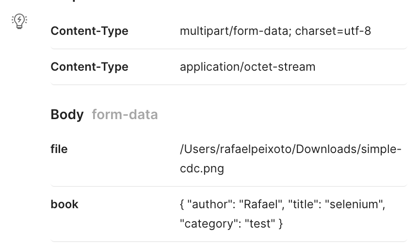

# Melhorando a automação de testes de API Rest na prática

Código usado na apresentação da palestra `Melhorando a automação de testes de API Rest na prática` na Conferência de testes de API Rest do Júlio de Lima

## Prerrequisitos

* Java 11
* Docker

## Como rodar esse teste na sua máquina

Você pode rodar local, subindo a aplicação na sua máquina o que te permite rodar alguns testes com o Postman, por exemplo.
Antes é necessário subir o banco:

```
docker-compose up
```

Assim que o banco subir na porta `3306`, basta rodar:

```
./gradlew bootRun
```

A aplicação subirá na porta `8080`. Pronto, já podemos começar a fazer testes. Uma vez que a API estiver de pé, você consegue consultar o swagger em:

```
http://localhost:8080/swagger-ui/#/book-controller
```

Uma outra opção é você rodar os testes automatizados que já existem nesse projeto. Para rodar os testes unitários:

```
./gradlew test
```

Para rodar os testes de integração:

```
./gradlew integrationTest
```

Ao rodar o comando acima, um servidor local subirá numa porta randômica. O teste já está preparado para isso. Ao final da execução o servidor é derrubado 
automaticamente. Nesses testes é utilizado um banco H2 (banco em memória), o banco também é inicializado sozinho e finalizado ao término da execução.
Por ser um banco em memória, os dados inseridos/alterados na base são perdidos a cada nova execução, sempre iniciando em um estado determinado no arquivo
`data.sql`.

Não é foco dessa apresentação, mas ainda é possível a execução de testes de mutação com o seguinte comando:

```
./gradlew pitest
```


Nesse primeiro momento vamos fazer um teste manual.
Vou utilizar o Postman por ser uma ferramenta bastante conhecida, mas fique a vontade de utilizar outra ferramenta de sua preferência.
Faremos então um `POST` em `/s3/books`. Precisamos passar dois objetos: um arquivo (imagem) e um json com os dados do livro que 
iremos cadastrar.



Após executar a requisição, você deve receber um status `201` e um corpo de resposta parecido com o a seguir:

```json
{
    "id": 16,
    "title": "selenium",
    "author": "Rafael",
    "bookCategory": null,
    "imagePath": "cover/simple-cdc.png"
}
```

Repare no último campo da resposta `imagePath`. Esse campo é preenchido automaticamente pela API com o caminho onde a imagem foi salva. Isso quer dizer que nossa imagem foi salva no S3 com sucesso. Se quiser, você pode abrir o console da AWS
e verificar se o arquivo realmente foi salvo na sua conta.

## <a id="segundaParte">O problema</a>

Até aqui fizemos um teste manual com nossa aplicação rodando localmente, mas fazendo a integração real com a AWS. 
Poderíamos agora fazer uma automação para isso e seria algo bem simples, mas existem algumas questões importantes que devemos considerar:

* Ao utilizar a integração real, mesmo que seja numa conta de teste, estamos consumindo um serviço AWS e isso tem um custo;
* Precisamos ter essa infra sempre em pé. Qualquer manutenção ou alteração no ambiente pode acabar atrapalhando o resultado dos testes;
* Alguém desavisado, pode fazer alterações em alguma configuração (excluir um bucket, por exemplo) e isso também pode atrapalhar nossos resultados.

E como podemos nos prevenir isso e ainda ter uma confiança nos nossos testes? Usando o LocalStack.

## O que é o LocalStack?

Utilizando a definição do próprio site do LocalStack:

> LocalStack is a cloud service emulator that runs in a single container on your laptop or in your CI environment. With LocalStack, you can run your AWS applications or Lambdas entirely on your local machine without connecting to a remote cloud provider! Whether you are testing complex CDK applications or Terraform configurations, or just beginning to learn about AWS services, LocalStack helps speed up and simplify your testing and development workflow.

Resumindo, é uma ferramenta que nos permite simular serviços da AWS através de containeres de maneira bem simples.

### Instalando o LocalStack

É aqui que entra a necessidade de termos o python instalado:

```shell script
python3 -m pip install localstack
```

Depois da instalação, basta dar um start nos serviços:

```shell script
localstack start
```

Você deverá ver um resultado parecido com a imagem a seguir:


Pronto! Seu ambiente AWS local está pronto para ser utilizado. O que precisamos agora é 
"dizer" para a nossa aplicação que ela deve apontar para o nosso serviço local e não mais para 
a AWS real, claro, que isso apenas nos testes.

Para não haver confusão de configurações, criei um arquivo `application-local.yml` que é uma cópia 
do `application.yml` principal. O primeiro terá a configuração para o localstack enquanto o segundo terá a configuração de 
produção.

Veja um pedaço do arquivo `application-local-yml` onde temos as configurações da AWS:

```yml
  aws:
    accessKey: test
    secretKey: test
    region: "us-east-1"
    s3:
      url: http://s3.localhost.localstack.cloud:4566
      bucket: mybucket
```

Os valores aqui de `access_key` e `secret_key` são valores fake. O mais importante é o valor do campo `url` que está apontando
para o S3 do LocalStack.

Ok, mas como vamos fazer para rodar uma configuração ou outra? A resposta é: utilizando 
profiles. No momento da subida da aplicação vamos passar um parâmetro a mais onde dizemos que iremos 
utilizar um profile `local`. Isso basta para que o Spring entenda que deve utilizar o arquivo `application-local` e não o 
arquivo principal.

```shell script
 ./gradlew bootRun --args='--spring.profiles.active=local' 
```

Se refizermos agora a mesma requisição anterior quando ainda usamos a configuração de produção, devemos ter um erro. 
Isso acontece porque não criamos um bucket no nosso LocalStack. Podemos fazer isso de maneira bem simples utilizando o terminal.

```shell script
aws s3 mb s3://mybucket --endpoint-url=http://localhost:4566/  
```

Para entender o comando acima:

* **aws s3**: dizemos qual serviço AWS vamos utilizar;
* **mb**: comando para criação de um bucket
* **s3://<nome_bucket>**: caminho do novo bucket (você pode escolher um nome diferente)
* e por fim a url apontando para o serviço LocalStack.

Agora podemos refazer a requisição que o resultado será de sucesso. E como podemos ver se realmente a imagem foi gravada 
no bucket? 

```shell script
aws s3 ls s3://mybucket/cover/ --endpoint-url=http://localhost:4566/
```

Nesse comando temos algumas coisas novas. Primeiro utilizamos o comando `ls` que lista os 
objetos. Por fim, informamos além do bucket a key `cover` que faz parte do caminho da imagem.
O resultado deve ser algo assim:

```shell script
2022-07-07 12:58:18      13853 simple-cdc.png
```

Teste manual concluído com sucesso.


